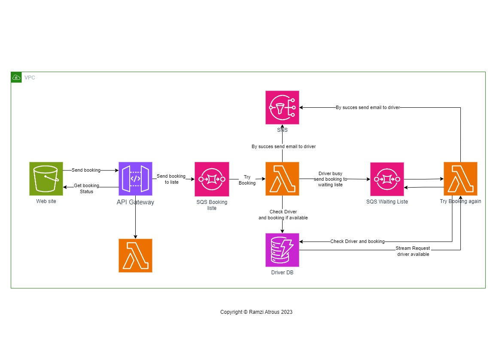

# Taxi Booking Project

### Architecture

### Are you in a hurry? , Need a ride?

#### Then you are in the right place.

#### Our website offers the best Taxi booking Deals worldwide.

## How it works :

- The client book a taxi in our wibsite.

- the website send post request with all the informations of the client to SQS queue throw API Gateway.

- The SQS Booking list send the informations as message to Lambda function.

- Lambda function check if there is available driver in DynamoDB Database.

- If check true then Lambda function send the client informations to SNS.

- SNS send the client informations per Email to the driver.

- In the case that check is false and there is any driver available then Lambda send the client informations to a second SQS (waiting list) .

- The SQS waiting list send the client information to a second Lambda that make the same steps.

- When there is a change by DynamoDB that a driver is available, then DynamoDB send a stream request to the second Lambda function to Invoke it again.

- Then the second Lamda try again to book.

- When true the driver becomme a Email with the client informations.

- A third Lambda function is there too to get the Booking status.

---

### Deployment

 ***The website can currently be visited [hier](http://client-management-v1.s3-website.eu-central-1.amazonaws.com) .***

Thank you for checking this out!
Feel free to leave me some *feedback*.